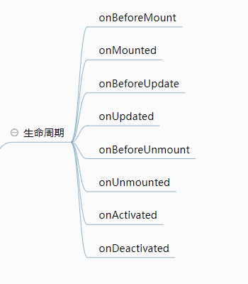

## 生命周期钩子
可以使用直接导入的onX函数注册生命周期钩子
```vue
<template>
  <div>
    <h3>{{ name }}</h3>
    <button @click="changeName">changeName</button>
  </div>
</template>

<script>
import { ref, onMounted, onUpdated, onUnmounted } from "vue"
export default {
  setup() {
    const name = ref("why")
    onMounted(() => {
      console.log("App onMounted")
    })
    onMounted(() => {
      console.log("App onMounted2")
    })
    onUpdated(() => {
      console.log("App onUpdated")
    })
    onUnmounted(() => {
      console.log("App onUnmounted")
    })

    const changeName = () => {
      name.value = "corderwhy"
    }

    return {
      name,
      changeName
    }
  }
}
</script>
```

## provide和inject
```javascript
// App.vue
    const name = ref("corderwhy");
    let counter = ref(100);
    
    provide("name", name);
    provide("counter", counter);

// Home.vue
    const name = inject('name')
    const counter = inject('counter')
```
不推荐，因为不是单向数据流
#### 抽离写法
```javascript
// App.vue
import useCounter from './hooks/useComponent.js'
export default {
  setup() {
      const {increment} = useCounter()

      return {
          increment
      }
  },
 
// hooks/useComponent.js
import { ref, provide } from "vue";

export default function () {
    const name = ref("corderwhy");
    let counter = ref(100);

    const increment = () => {
        counter.value++
    }
    provide("name", name);
    provide("counter", counter);

    return {
        increment
    }
}
```
## 使用localStorage
```javascript
// App.vue
import useLocalStorage from './hooks/useLocalStorage.js'
export default {
  setup() {
      useLocalStorage('name', {'name': 'zs', 'age': 18})
  },
};
// useLocalStorage.js

import { ref, watch } from "vue"
export default function(key, value) {
    const data = ref(value)
    if (value) {
        window.localStorage.setItem(key, JSON.stringify(value))
    } else {
        data.value = JSON.parse(window.localStorage.getItem(key))
    }

    watch(data, val => {
        window.localStorage.setItem(key, JSON.stringify(val))
    })
    return data
}
```
### 再次抽离
新建index.js
```javascript
import useComponent from './hooks/useComponent.js'
import useLocalStorage from './hooks/useLocalStorage.js'

export {
    useComponent,
    useLocalStorage
}
App.vue只需引入index.js
import { useComponent, useLocalStorage } from "./hooks/index";
```
## h函数
h()函数是用于创建vnode的一个函数

render是export default的一个选项，返回的是一个vnode即h函数

参数：

```javascript
{ string | object |function }
```

一个HTML标签名，一个组件，一个异步组件、或一个函数式组件

如果会产生歧义，第二个参数可以将null传入，第三个参数可以将children传入
基本使用：
```javascript
<script>
import { h } from 'vue'
export default {
    render () {
        return h('h2', {class: 'title'}, 'hello world')
    }
}
</script>
```
案例
```javascript
// setup实现
<script>
import { ref, h } from "vue";
export default {
  setup() {
    const counter = ref(0);

    return () => {
      return h("div", { class: "app" }, [
        h("h2", null, `当前计数：${counter.value}`),
        h(
          "button",
          {
            onclick: () => counter.value++,
          },
          "+1"
        ),
        h(
          "button",
          {
            onclick: () => counter.value--,
          },
          "-1"
        ),
      ]);
    };
  },
};
</script>

// data实现
<script>
import { h } from "vue";
export default {
  data() {
    return {
      counter: 0,
    };
  },
  render() {
    return h("div", { class: "app" }, [
      h("h2", null, `当前计数：${this.counter}`),
      h(
        "button",
        {
          onclick: () => this.counter++,
        },
        "+1"
      ),
      h(
        "button",
        {
          onclick: () => this.counter--,
        },
        "-1"
      ),
    ]);
  },
};
</script>
```
传入组件
```javascript
<script>
import { h } from "vue";
import Home from './Home'
export default {
    render () {
        return h(Home, null,  '')
    }
};
</script>
```
render 插槽
```javascript
// App.vue
<script>
import { h } from "vue";
import Home from './Home'
export default {
    render () {
        return h(Home, null, {
            default: props => h('sapn', null, 'app传入home中的内容')
        } )
    }
};
</script>

// Home.vue
<script>
import {h} from 'vue'
export default {
    render () {
        return h('div', null, [
            h('h2', null, 'hello world'),
            this.$slots.default ? this.$slots.default() : h('span', null, '默认值')
        ])
    }
}
</script>
```
### jsx
jsx 通常会通过 babel 进行转换
```javascript
npm install @vue/babel-plugin-jsx -D
```
babel.config.js
```javascript
module.exports = {
  presets: [
    '@vue/cli-plugin-babel/preset'
   ],
  plugins: [
    '@vue/babel-plugin-jsx'
   ]
jsx
// App.vue
<script>
import Home from './Home.vue'
export default {
  data() {
    return {
      counter: 0,
    };
  },
  render() {
    const increment = () => this.counter++;
    const decrement = () => this.counter--;

    return (
      <div>
        <h2>当前计数： {this.counter}</h2>
        <button onclick={increment}>+1</button>
        <button onclick={decrement}>-1</button>
        <Home>
            {{default: props => <button>我是按钮</button>}}
        </Home>
      </div>
    );
  },
};
</script>

// Home.vue
<script>
export default {
    render () {
        return (
            <div>
                <h2>Home</h2>
                {this.$slots.default ? this.$slots.default() : <span>hahhaha</span>}
            </div>
        )
    }
}
</script>
```
## 自定义指令
对DOM元素进行底层操作时，就会用到自定义指令。
- 自定义局部指令：组件中通过 directives 选项，只在当前组件中使用。
- 自定义全局指令：app 的 directive 选项，可以在任意组件中被使用。
  
局部指令：
```javascript
<template>
    <div>
        <input type="text" v-focus>
    </div>
</template>

<script>
export default {
    // 局部指令
    directives: {
        focus: {
            mounted(el, binding, vnode, preVnode) {
                el.focus()
            }
        }
    }
}
</script>
```
全局指令：
```javascript
// 全局指令在main.js
const app = createApp(App)

app.directive('focus', {
    mounted(el, binding, vnode, preVnode) {
        el.focus()
    }
})

app.mount('#app')
```
### 指令的生命周期
- created：当绑定元素的 attribute 或事件监听器被应用之前调用
- beforeMount：当指令第一次绑定到元素并且在挂载父组件之前调用
- mounted：在绑定元素的父组件被挂载后调用
- beforeUpdated：在更新包含组件的VNode之前调用
- updated：在包含组件的VNode以及子组件的VNode更新后调用
- beforeUnmount：在卸载绑定元素的父组件之前调用
- unmounted：当指令与元素解除绑定且父组件已卸载时，只调用一次

### 指令的钩子函数
binding：传入的参数和修饰符
```javascript
// main.js
import { createApp } from 'vue'
import App from './05自定义指令/App.vue'
import registerDirectives from './05自定义指令/directives'

const app = createApp(App)
registerDirectives(app)
app.mount('#app')

// directive文件夹下index.js
import registerFormatTime from './formatTime'
export default function registerDirectives(app) {
    registerFormatTime(app)
}

// directive文件夹下formatTime.js
import dayjs from 'dayjs'
export default function (app) {
    app.directive('format-time', {
        created(el, binding) {
            binding.formatString = 'YYYY-MM-DD HH:mm:ss'
            if (binding.value) {
                binding.formatString = binding.value
            } 
        },
        mounted(el, binding) {
            const textContent = el.textContent
            const timestamp = parseInt(textContent)
            if (textContent.length === 10) {
                timestamp = timestamp * 1000
            }
            // dayjs第三方库转化
            el.textContent = dayjs(timestamp).format(binding.formatString)        

        }
    })
}
```
## 新组件
### teleport
将组件html结构移动到指定位置

两个属性：
- to：目标，可以使用选择器
- disabled：是否禁用 teleport 的功能
```javascript
<template>
    <teleport to="#why">
      <h2>当前计数：</h2>
      <button>+1</button>
    </teleport>
</template>
```
## Vue 插件
向 vue 全局添加功能的时候，会采用插件的模式，它有两种编写模式：
- 对象类型：一个对象，必须包含一个 install 的函数，该函数会在安装插件时执行
- 函数类型：一个 function，这个函数会在安装插件时自动执行
  
以下使用：
1. 添加全局属性和方法：config.globalProperties
2. 添加全局资源：指令、过滤器、过渡
3. 全局 mixin 添加一些组件选项
4. 一个库，提供自己的api 
   
对象：
```javascript
// plugins文件夹下 plugin_01.js
export default {
    install(app) {
        app.config.globalProperties.$name = 'wangwang'
    }
}
```
```javascript
// main.js
import { createApp } from 'vue'
import App from './06新增组件/App.vue'
import plugin_01  from './07plugins/plugin_01'

const app = createApp(App)

app.use(plugin_01)
app.mount('#app')
```
```javascript
// App.vue
<template>
  <div>
    <h2>{{$name}}</h2>
  </div>
</template>

<script>
import { getCurrentInstance } from 'vue'
export default {
    setup () {
        const instance = getCurrentInstance()
        console.log(instance.appContext.config.globalProperties.$name)
    }
};
</script>
```
函数
```javascript
// plugins文件夹下 plugin_02.js
export default function (app) {
     ...
}
     
// main.js
import { createApp } from 'vue'
import App from './06新增组件/App.vue'
import plugin_02  from './07plugins/plugin_02'

const app = createApp(App)

app.use(plugin_02)
app.mount('#app')
```


